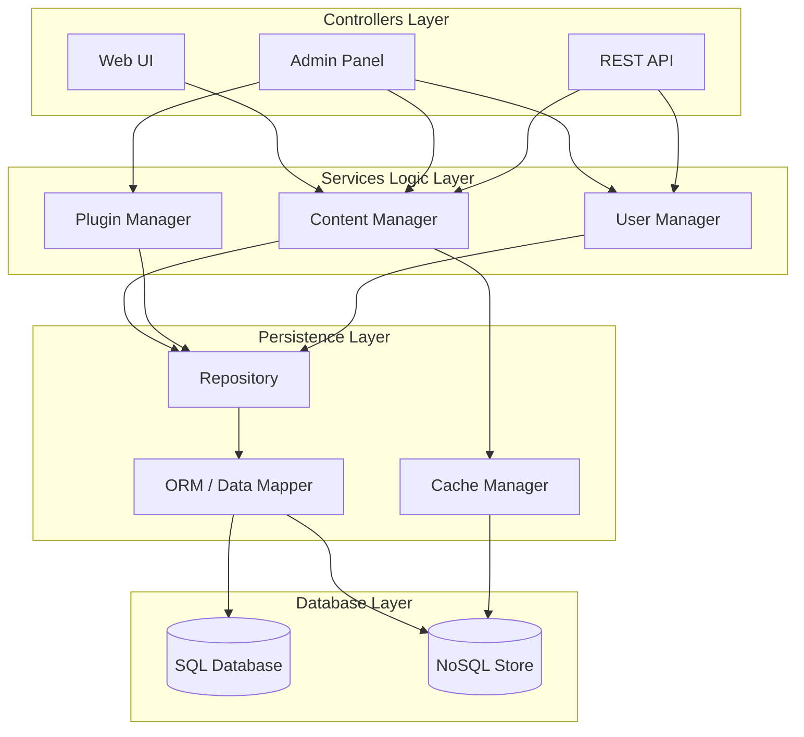
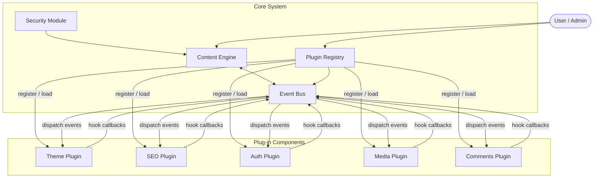

# Plugin-based CMS — Phân tích Kiến trúc Phần mềm

> **Môn học:** Thiết kế Kiến trúc Phần mềm
> **Tuần:** 4
> **Tài liệu tham khảo:** *Fundamentals of Software Architecture* — Mark Richards & Neal Ford (O'Reilly, 2020)

---

## 1. Layered Architecture

### 1.1 Mô tả

Layered Architecture (kiến trúc phân tầng) tổ chức hệ thống thành các tầng nằm chồng lên nhau theo thứ bậc. Mỗi tầng chỉ được phép giao tiếp với tầng liền kề bên dưới. Với Plugin-based CMS, các tầng được xác định như sau:

| Tầng | Trách nhiệm chính |
|---|---|
| **Controllers Layer** | Giao tiếp người dùng — Web UI, Admin Panel, REST API |
| **Services Logic Layer** | Xử lý nghiệp vụ lõi — Content Manager, Plugin Manager, User Manager |
| **Persistence Layer** | Truy cập và ánh xạ dữ liệu — Repository, ORM, Cache Manager |
| **Database Layer** | Lưu trữ vật lý — SQL Database / NoSQL Store |

### 1.2 Sơ đồ

### 1.3 Đặc điểm trong ngữ cảnh CMS

- **Plugin Manager** nằm trong Business Logic Layer → plugin giao tiếp qua lớp quản lý trung gian, không có cơ chế inject động thực sự.
- Mọi yêu cầu đều phải đi qua **toàn bộ stack** từ Presentation → Database, kể cả khi chỉ cần đọc một bài viết đơn giản.
- Để thêm plugin mới, lập trình viên phải **sửa đổi Business Logic Layer** — vi phạm nguyên tắc Open/Closed.

---

## 2. Microkernel Architecture

### 2.1 Mô tả

Microkernel Architecture (kiến trúc vi nhân) tách biệt một **Core System** (nhân nhỏ, ổn định) khỏi các **Plug-in Components** (mô-đun mở rộng, thay thế được). Core System chứa chức năng tối thiểu cần thiết để CMS vận hành; tất cả tính năng bổ sung được đóng gói trong plugin độc lập.

| Thành phần | Vai trò |
|---|---|
| **Content Engine** | Quản lý nội dung lõi (CRUD bài viết, trang) |
| **Plugin Registry** | Đăng ký, nạp, huỷ plugin theo lifecycle |
| **Event Bus** | Cơ chế Hook / Event cho plugin đăng ký lắng nghe |
| **Security Module** | Xác thực & phân quyền tầng core |
| **Plugin (n)** | Theme, SEO, Auth mở rộng, Media, Comments… |

### 2.2 Sơ đồ

### 2.3 Đặc điểm trong ngữ cảnh CMS

- **Core System không thay đổi** khi thêm tính năng mới — plugin được nạp động qua Plugin Registry.
- **Event Bus** cung cấp cơ chế hook (tương tự WordPress `add_action` / `add_filter`) cho phép plugin can thiệp vào vòng đời xử lý nội dung mà không cần sửa core.
- Plugin có thể **bật/tắt độc lập** mà không ảnh hưởng core hoặc các plugin khác.
- Ví dụ thực tế: **WordPress** (hook system), **Drupal** (module system), **Strapi** (plugin API).

---

## 3. So sánh Ưu / Nhược điểm

> Đánh giá theo 7 tiêu chí kiến trúc trong *Fundamentals of Software Architecture* (Richards & Ford, 2020) — Chương 10 & 12.
> Thang điểm: (1) Thấp | (2) Trung bình | (3) Cao

### 3.1 Bảng tổng hợp

| Đặc tính kiến trúc | Layered | Microkernel | Ghi chú |
|---|:---:|:---:|---|
| **Overall Agility** (Linh hoạt thay đổi) | 1 | 3 | Layered phải sửa nhiều tầng khi thay đổi yêu cầu |
| **Ease of Deployment** (Dễ triển khai) | 1 | 3 | Microkernel: deploy plugin riêng lẻ, không rebuild toàn bộ |
| **Testability** (Khả năng kiểm thử) | 3 | 3 | Cả hai đều có thể test từng unit độc lập |
| **Performance** (Hiệu năng) | 2 | 3 | Layered: overhead qua nhiều tầng; Microkernel: event dispatch có chi phí nhỏ |
| **Scalability** (Khả năng mở rộng quy mô) | 1 | 2 | Cả hai không phải kiến trúc phân tán, khó scale ngang |
| **Ease of Development** (Dễ phát triển ban đầu) | 3 | 2 | Layered quen thuộc, ít learning curve; Microkernel cần thiết kế plugin API kỹ |
| **Extensibility** (Khả năng mở rộng tính năng) | 1 | 3 | **Điểm then chốt**: Microkernel sinh ra để mở rộng qua plugin |

### 3.2 Phân tích chi tiết

#### Layered Architecture

**Ưu điểm**
- **Đơn giản, quen thuộc** — Đây là pattern phổ biến nhất, hầu hết lập trình viên đều hiểu ngay cấu trúc.
- **Separation of Concerns rõ ràng** — Mỗi tầng có trách nhiệm riêng biệt, dễ bảo trì trong phạm vi nội tầng.
- **Testability cao** — Có thể mock/stub tầng dưới để test tầng trên một cách cô lập.
- **Phù hợp với hệ thống CRUD đơn giản** — Nếu CMS không cần mở rộng plugin, Layered hoạt động tốt.

**Nhược điểm**
- **Architecture Sinkhole Anti-pattern** *(Richards & Ford, Ch.10)*: Các request thường xuyên "rơi" qua nhiều tầng mà không xử lý gì thực sự, gây overhead không cần thiết.
- **Không hỗ trợ mở rộng plugin thực sự** — Plugin Manager bị nhét vào Business Logic Layer, không có cơ chế độc lập để add/remove tính năng mà không sửa code lõi.
- **Tight coupling giữa các tầng** — Thay đổi schema database hoặc logic nghiệp vụ lan rộng ra nhiều tầng.
- **Khả năng deploy thấp** — Toàn bộ ứng dụng phải được deploy lại khi có thay đổi ở bất kỳ tầng nào.

#### Microkernel Architecture

**Ưu điểm**
- **Mở rộng tính năng mà không sửa core** *(Open/Closed Principle)* — Plugin mới được thêm bằng cách implement interface và đăng ký vào Plugin Registry.
- **Khả năng customize cao** — Người dùng cuối (hoặc nhà phát triển bên thứ ba) có thể viết plugin mà không cần hiểu core system.
- **Core ổn định** — Sau khi core được kiểm thử và release, nó hiếm khi thay đổi, giảm risk regression.
- **Deploy độc lập** — Plugin có thể deploy riêng lẻ mà không ảnh hưởng core hoặc các plugin khác.
- **Phù hợp với hệ sinh thái marketplace** — Đây là cơ sở cho WordPress Plugin Directory, Drupal Module ecosystem, v.v.

**Nhược điểm**
- **Phức tạp khi thiết kế ban đầu** — Cần định nghĩa rõ Plugin API Contract, versioning, dependency management giữa các plugin.
- **Scalability vẫn còn hạn chế** — Microkernel là monolithic về bản chất, không phân tán được dễ dàng như Microservices.
- **Rủi ro plugin quality** — Plugin của bên thứ ba có thể gây lỗi, security vulnerability nếu không có sandbox hoặc review process.
- **Event Bus có thể trở thành bottleneck** — Khi quá nhiều plugin đăng ký hook trên cùng một event, hiệu năng giảm (thấy rõ ở các WordPress site cài hàng trăm plugin).

---

## 4. Đề xuất Architecture Style cho Plugin-based CMS

### Lua chon: **Microkernel Architecture**

### 4.1 Lý do chính

Tên hệ thống là **Plugin-based CMS** — bản chất của nó là một hệ thống được thiết kế để mở rộng qua plugin. Đây chính xác là vấn đề mà Microkernel Architecture được tạo ra để giải quyết.

> *"The microkernel architecture style is a natural fit for product-based applications. A product-based application is typically installed and used as a single, monolithic deployment, yet needs to allow for the addition of features and customization that may vary from customer to customer."*
> — Richards & Ford, *Fundamentals of Software Architecture*, Ch.12

**CMS là product-based application điển hình:**
- **Core ổn định**: Các chức năng xuất bản nội dung (tạo, sửa, xoá bài; phân quyền; routing) không thay đổi thường xuyên.
- **Tính năng biến đổi theo người dùng**: SEO plugin, comment system, theme, social sharing, analytics — mỗi khách hàng hoặc site có nhu cầu khác nhau.
- **Third-party extensibility**: Plugin marketplace tạo ra hệ sinh thái, không thể yêu cầu tác giả plugin sửa core.

### 4.2 Tại sao không chọn Layered?

| Vấn đề CMS yêu cầu | Layered | Microkernel |
|---|---|---|
| Thêm plugin mà không sửa core |  Phải sửa Business Logic Layer |  Đăng ký vào Plugin Registry |
| Bật/tắt tính năng theo từng site |  Phải build lại app |  Toggle plugin on/off |
| Tác giả thứ ba viết plugin |  Phải hiểu và sửa toàn bộ layered stack |  Implement Plugin Interface công khai |
| Deploy feature mới không downtime |  Deploy lại toàn bộ |  Hot-load plugin mới |

### 4.3 Điều chỉnh thực tế

Trong thực tế, một Plugin-based CMS hiện đại thường kết hợp:
- **Microkernel** làm nền tảng chính (cho extensibility)
- **Layered internals** bên trong Core System (để tổ chức code rõ ràng, dễ test)
- Tùy chọn mở rộng lên **Microservices** nếu cần scale (Strapi headless CMS làm theo hướng này)

Tuy nhiên, nếu phải chọn **một** architectural style chủ đạo cho Plugin-based CMS: **Microkernel là lựa chọn duy nhất đúng** vì nó align hoàn toàn với bản chất mở rộng-qua-plugin của hệ thống.

---

## Tài liệu tham khảo

- Richards, M., & Ford, N. (2020). *Fundamentals of Software Architecture: An Engineering Approach*. O'Reilly Media.
  - Chapter 10: Layered Architecture Style
  - Chapter 12: Microkernel Architecture Style
